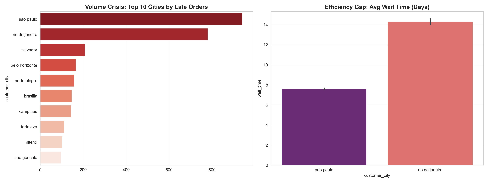
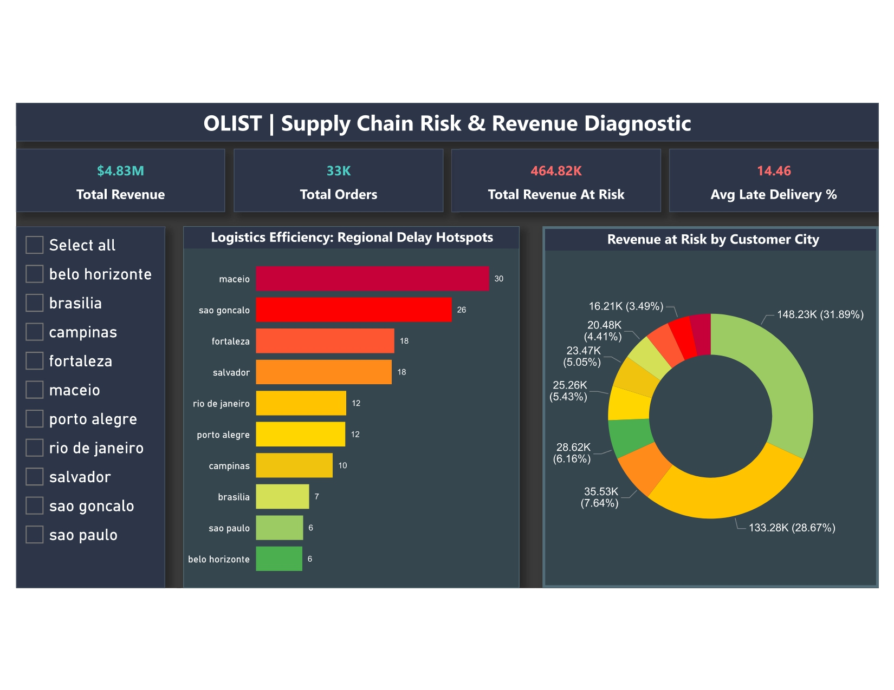
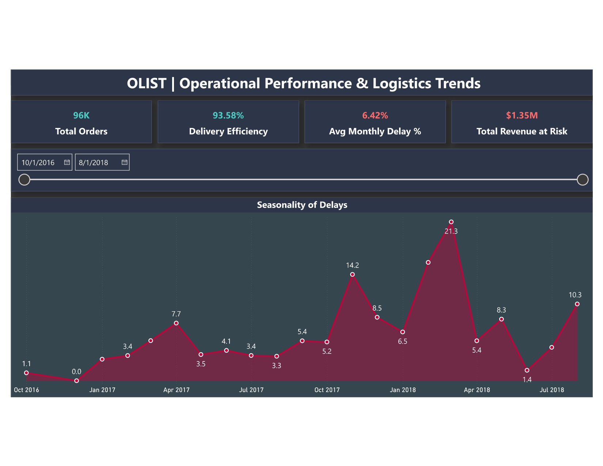

**Olist Supply Chain Risk & Recovery Diagnostic**

**Project Overview**
This project analyzes OLIST’s e-commerce logistics performance using 100,000+ orders to identify delivery delays, revenue exposure, and regional bottlenecks.
The objective is simple.
Translate operational data into decisions that protect revenue and customer trust.

**Business Problem**
Late deliveries are rarely treated as a financial risk.
They appear as customer complaints long before they show up in revenue reports.
This analysis answers three critical questions:
Where do delivery delays actually concentrate?
How much revenue is financially exposed because of them?
Which cities and seller structures create the highest operational risk?

**Tech Stack**
MySQL — The Engine
Scalable schema design, bulk ingestion, null-safe datetime handling, indexed joins, and revenue-at-risk logic.
Python (Pandas, Matplotlib) — The Diagnostic Tool
Order-level forensics, delay flagging, seller complexity analysis, and automated reporting.
Power BI — The Storyteller
Executive dashboards for city-level risk, seasonality trends, and revenue exposure.
VS Code 
Development environment and version control.

**SQL & Operational Logic (The Backbone)**
SQL is where the business rules live. This wasn’t simple data pulling. It was engineered logic.

**Revenue-at-Risk Calculation**
Payment values aggregated only for orders where
actual_delivery_date > promised_delivery_date.

**Data Integrity Controls**
Analysis restricted to delivered orders to prevent false delay inflation.
All datetime fields handled using null-safe logic.

**Relational Mapping**
Joined 8+ tables (Orders, Payments, Sellers, Customers, Items) while preserving a strict one-row-per-order grain.

**Key Findings**
$1.35M in revenue at risk due to delayed fulfillment.
March 2018 system failure, with delay rates exceeding 21%.
Regional bottlenecks in cities like Maceió and São Gonçalo, despite lower order volumes.
Seller complexity effect: higher seller counts strongly correlate with delivery delays.

**📊 Visual Analysis**
**Python Diagnostics**

**Power BI Dashboards**

**Business Recommendations**
Reallocate carriers for high-risk cities based on diagnostic outputs.
Introduce seller performance thresholds tied to delivery SLAs.
Add regional buffer stock ahead of seasonal peaks like March.
Track revenue at risk as a live operational KPI, not a retrospective metric.

**Next Sprint**
This project focuses on descriptive diagnostics.
The next phase moves into predictive analytics, building a forecasting model to identify delivery delays before they occur.
Prevention is cheaper than recovery.
